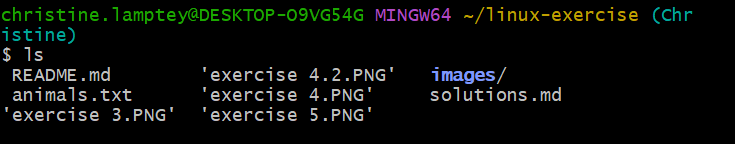

# Exercise 1
- 'touch'- creates an empty file or updates the timestamp if the file exists.
- 'cat'- can create a file and let you input content, but it's used mainly to read/display file contents.

# Exercise 2
- File permissions control read(r),write(w), and execute(x) access for owner, group, and others.
- Displaying permissions:
   - ls -1
   - stat filename
   - ls-ld directory
- Default permissions for a file when created:
  - -rw-r--r-- 
  - meaning:
    owner can read and write rw-
    group can read r--
    others can read r--
- Default permissions for a folder when created:
  - drwxr-xr-x
  - meaning:
    owner can read,write and execute rwx
    group can read and execute r-x
    others can read and execute r-x

- Creating a folder in Linux
  - mkdir foldername

# Exercise 3 
- Command to print number of lines, words and characters in a file:
- wc filename

# Exercise 4

Explanation
- head -n 3 animals.txt outputs the first 3 lines.
- head -n 3 animals.txt | wc -w - piping that output into wc -w counts the number of words in the lines.

# Exercise 5 
- The command is 'grep'. 

- The command searches for the specified word and prints the line with the word in it. 

# Exercise 6
- 'ls'

- A directory is like a folder on your computer. It holds files and other directories.

# Exercise 7
- 'pwd' is print working directory. it shows the full path of the current directory you are in.
- 'echo' - prints text and variables to the terminal.
- 'cd' changes the current directory you are working in.

# Exercise 8
- 'dirs' - shows the list of directories in the directory stack. It helps navigate through a stack of saved directories. 

- use the manual command i.e. 'man'

# Exercise 9

- 'grep': Searches for lines matching a pattern.

- ' awk' : searches. extracts andd manipulate columns/fields.

# Exercise 10
- Environment Variables- dynamic values that affect the behaviour of processes and programs in a system.
- HOME : path to your home directory
- PATH : directories where executables are searched
- USER : current logged-in user
- SHELL : default shell program
- PWD : present working directory

- 'more': allows forward navigation only (basic)
- 'less': supports forward and backward navigation, searching, and better performance (advanced)

# Exercise 11
- 'file filename'

# Exercise 12
- The Filesystem Hierarchy Standard (FHS)
Important folders in the tree:
   - /home - user home directories
   - /etc - system configuration file
   - /bin - essential binary executables

# Exercise 13 

# Exercise  14

Notes 
- '-t' - sets comma as delimiter
- '-k3'- sorts by the 3rd field
- '-n' - numeric sort
- 'sed'- stands for stream editor.It is used to find,replace,insert,delete,or transform text in a file or input stream.It processes text line-by-line and outputs the modified text.
- 's' - substitute
- 'g' - replace all ocurrences on each line (global)

# Exercise 15

